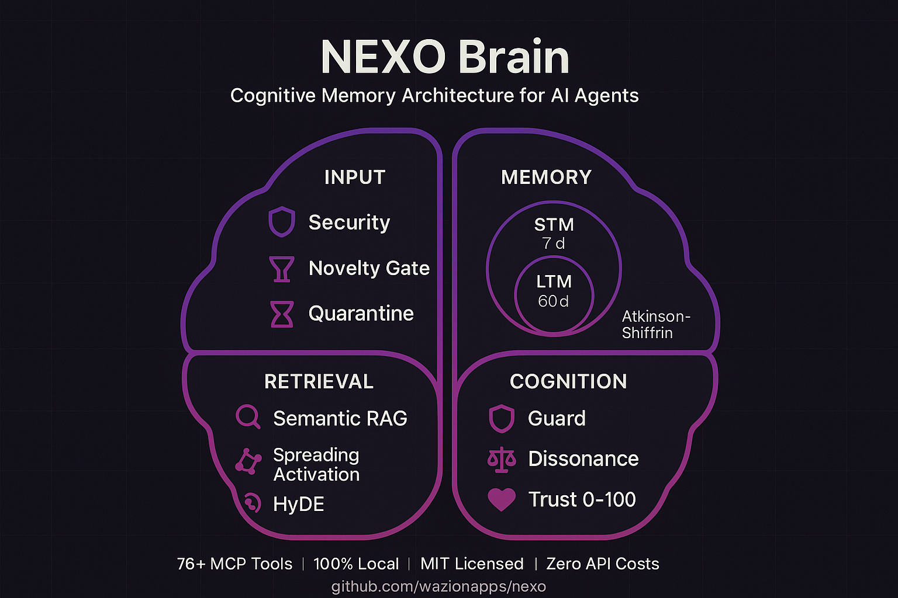

# NEXO Compare Scorecard

NEXO is the local cognitive runtime that makes the model around your model smarter.

Generated: 2026-04-10T10:57:28.286049+00:00

## What this scorecard is

- A public proof surface for the claims NEXO makes most often.
- A mix of benchmark data, internal ablations, runtime telemetry, and parity guardrails.
- A map of inspectable artifacts, not a substitute for reading the underlying files.

## Claims you can inspect today
- NEXO publishes a measured long-conversation memory result on LoCoMo instead of relying only on architecture claims.
  - Evidence: `benchmarks/locomo/results/locomo_nexo_summary.json`, `features/benchmark/index.html`
  - Scope: Benchmark result is memory-specific; it is not a universal score for every runtime capability.
- NEXO shows external baselines and internal ablations side by side so the score is easier to interpret.
  - Evidence: `benchmarks/runtime_ablations/results/ablation_summary.json`, `compare/scorecard.json`
  - Scope: External baselines come from the public LoCoMo discussion; internal ablations come from checked-in NEXO artifacts.
- Client parity across Claude Code and Codex is audited by code and docs, not left as a vague promise.
  - Evidence: `scripts/verify_client_parity.py`, `docs/client-parity-checklist.md`
  - Scope: Parity claims refer to the audited runtime surfaces listed in the checklist and script output.
- NEXO publishes longitudinal local runtime telemetry separately from benchmark scores.
  - Evidence: `compare/scorecard.json`, `compare/README.md`
  - Scope: Runtime windows are local operational telemetry; they are not folded into LoCoMo F1.

## What this scorecard does not claim

- It is not a universal winner-takes-all benchmark for every agent workload.
- LoCoMo measures long-conversation memory, not the full product surface.
- Longitudinal runtime windows come from local operator telemetry and should be read as operational evidence, not as a public SaaS benchmark.

## Measured benchmark
- LoCoMo overall F1: 0.5875
- LoCoMo overall recall: 0.7487
- Open-domain F1: 0.6366
- Multi-hop F1: 0.3329
- Temporal F1: 0.3258

## Ablation / baseline suite
- Combined external + NEXO ablation baselines (2026-04-06)
- Raw model baseline (GPT-4 128K full context): F1 0.379
- Gemini Pro 1.0 baseline: F1 0.313
- Retrieval baseline (GPT-3.5 + Contriever RAG): F1 0.283
- NEXO memory-only mode (LoCoMo RAG): F1 0.5875
- NEXO cognitive-cycle mode: F1 0.2931

## Longitudinal local runtime metrics
- 30d: success 13.0% | avg close 8.2 min | recovery 65.4% | open protocol debt 15 | unnecessary tool 3.4% | cost/solved 23.534217 USD
- 60d: success 13.0% | avg close 8.2 min | recovery 65.4% | open protocol debt 15 | unnecessary tool 3.4% | cost/solved 23.534217 USD
- 90d: success 13.0% | avg close 8.2 min | recovery 65.4% | open protocol debt 15 | unnecessary tool 3.4% | cost/solved 23.534217 USD

## System On Top Of Model

## Public API surface
- MCP wrappers: `nexo_remember`, `nexo_memory_recall`, `nexo_consolidate`, `nexo_run_workflow`
- Python SDK: `src/nexo_sdk.py`
- Quickstart: `docs/quickstart-5-minutes.md`

## Client parity guardrails
- `scripts/verify_client_parity.py`
- `docs/client-parity-checklist.md`
- runtime doctor parity audits

## Artifact map
- `locomo_summary`: `benchmarks/locomo/results/locomo_nexo_summary.json`
- `ablation_summary`: `benchmarks/runtime_ablations/results/ablation_summary.json`
- `compare_readme`: `compare/README.md`
- `compare_scorecard`: `compare/scorecard.json`
- `benchmark_page`: `features/benchmark/index.html`
- `parity_audit`: `scripts/verify_client_parity.py`
- `parity_checklist`: `docs/client-parity-checklist.md`
- `quickstart`: `docs/quickstart-5-minutes.md`
- `python_sdk`: `src/nexo_sdk.py`
